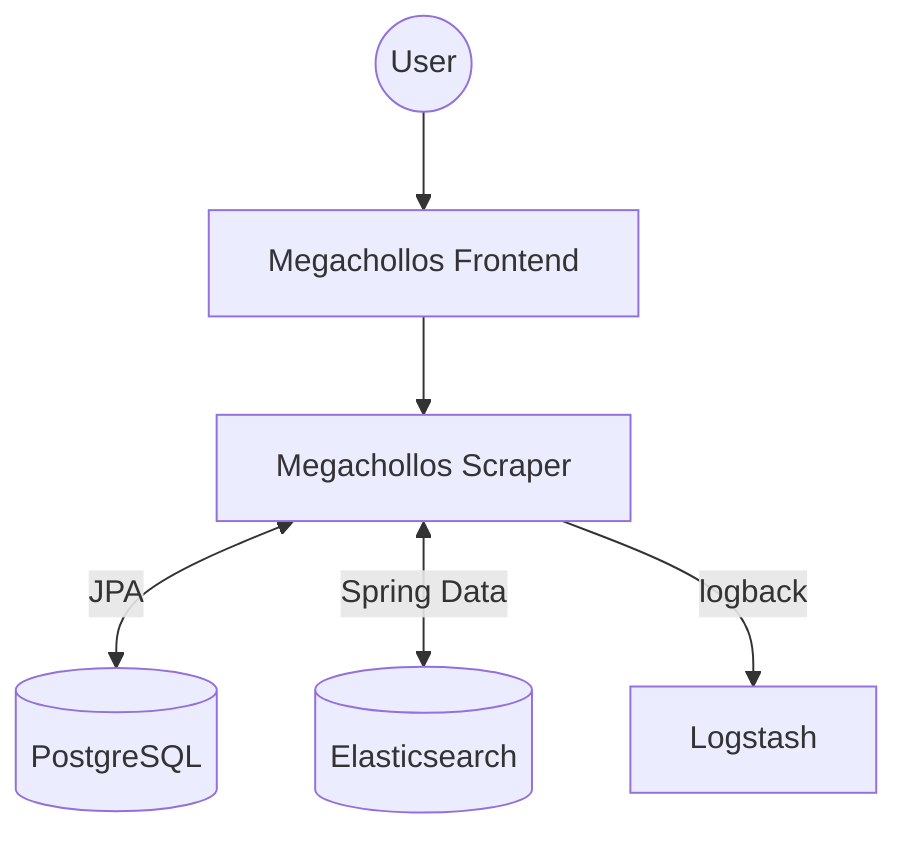

# megachollos

A web application to store and search discounted products from different e-commerce sites.

> Product prices are not updated once stored, so consistency with e-commerce prices is not guaranteed.

## Concepts

| **Concept**  | **Description**                                                                    | **Example**            |
|--------------|------------------------------------------------------------------------------------|------------------------|
| Category     | A tree of categories, decoupled from products.                                     | Data Storage           |
| Model        | Leaf nodes of the category tree, linked to products in Elasticsearch.              | Micro SD Card          |
| Brand        | Product brands stored in Elasticsearch.                                            | Samsung                |
| Ecommerce    | E-commerce sites from which products are retrieved.                                | MediaMarkt             |
| Product      | A product retrieved from an e-commerce site, identified by model and brand.        | MediaMarkt@A5000394782 |

## Components



## Use Cases

### Search Products

Search products using Elasticsearch scroll. Supports filters and sorting.

- Indexing types configured in `test/resources/json/mapping.json`
    - **Default**: Analyzed text (queryString operator for global search)
    - **keyword**: Non-analyzed text (contains, equal operators, ...)
    - **dynamic**: Inferred by Elasticsearch based on data type (greaterThan operators, ...)
- Text analyzer configured in `test/resources/json/settings.json`
    - Fields are indexed as ngrams
        - `token_chars` tokenizes by words: `Tarjeta SD` -> `Tarjeta`, `SD`
        - `edge_ngram` generates ngrams from the start of each token: `SD` -> `SD`; `Tarjeta` -> `Ta`, `Tar`, `Tarj`, ...
    - Includes filters for case-insensitive and accent-insensitive search

### Product Stats

Retrieve aggregated statistics and filter values for products.

## Procedures

### Generating brands, categories and models

These are the seed data used for product lookups.

1. Run `megachollos/resources/scripts/categories_tree_to_sql.py`
2. Copy the generated categories and brands to `megachollos/resources/db.changelog/db.changelog-1.2.sql`

## Limitations

- The `queryString` filter operator requires values with at least 3 characters.

## Cache

```
GET /ecommerces - 1 month (manual eviction: DELETE /actuator/caches/{cache})  
GET /brands - 1 month (manual eviction: DELETE /actuator/caches/{cache})  
```

## Tech Stack

- Java 17, Spring Boot 3.4
- PostgreSQL (via Liquibase migrations)
- Elasticsearch 8.12
- Testcontainers for integration tests
